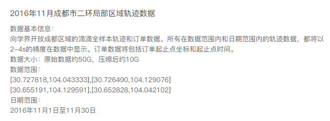
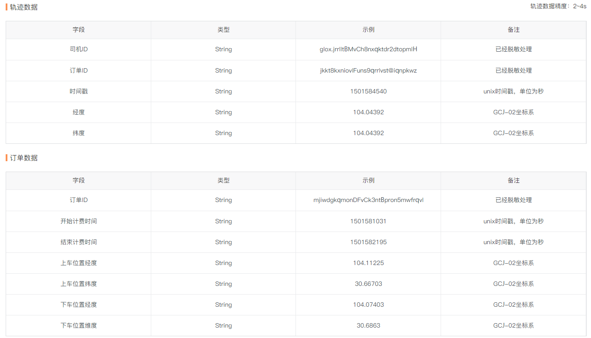
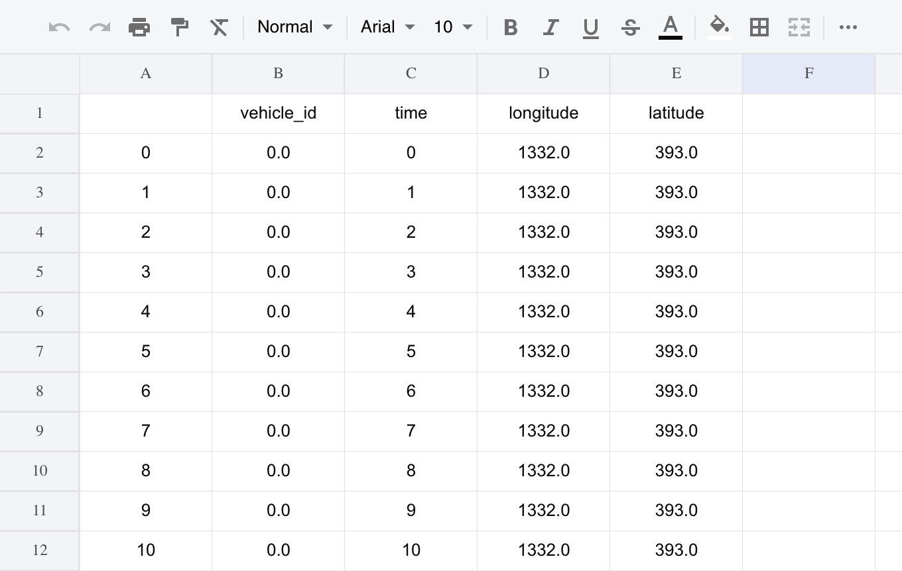
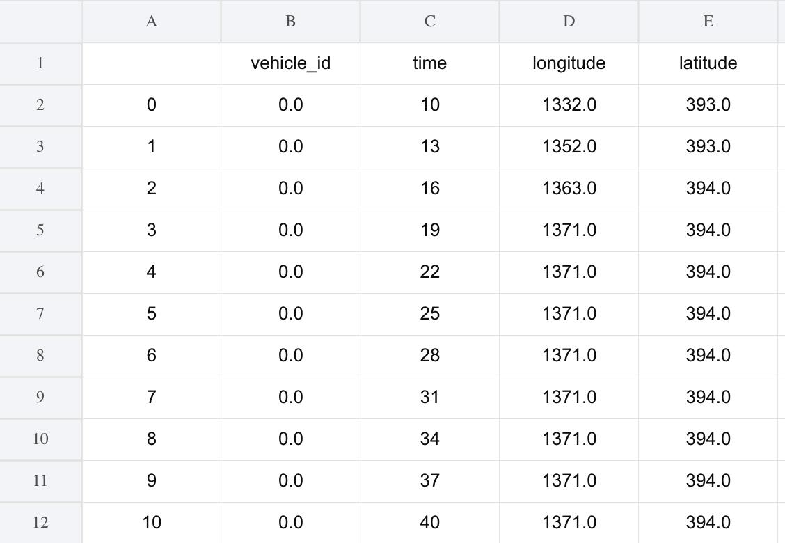
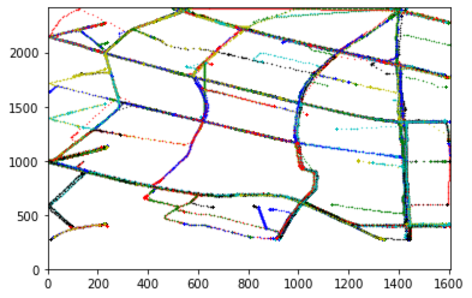
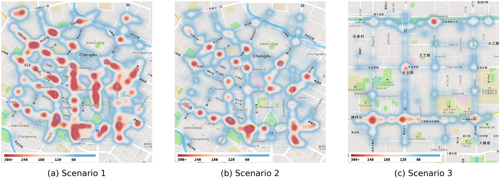

# Vehicular-Trajectories-Processing-for-Didi-Open-Data

Vehicular trajectories processing for Didi GAIA Open Data Set

## 01 Data Source

The project is dedicated to process the vehicular trajectories exacted by Didi GAIA Open Data Set.

<div align="center">
	
</div>

<div align="center">
	
</div>

Due to copyright issues, we are only sharing one day's data, which was generated in Chengdu on November 16, 2016. Please contact me if there is any infringement.

The data is available: [http://gofile.me/6GOPQ/tWqiB4afG](http://gofile.me/6GOPQ/tWqiB4afG)

Or you may just scan the QR code.


## 02 Usage

### a) Trajectory Processing

```python
    trajectories_file_name: str = 'CSV/gps_20161116'
    longitude_min: float = 104.04565967220308
    latitude_min: float = 30.654605745741608
    trajectories_time_start: str = '2016-11-16 08:00:00'
    trajectories_time_end: str = '2016-11-16 08:05:00'
    trajectories_out_file_name: str = 'CSV/trajectories_20161116_0800_0805'
  
    processor = vehicleTrajectoriesProcessor(
        file_name=trajectories_file_name, 
        longitude_min=longitude_min, 
        latitude_min=latitude_min,
        map_width=2000.0,
        time_start=trajectories_time_start,
        time_end=trajectories_time_end, 
        out_file=trajectories_out_file_name,
    )  
```

Output CSV Example

* CSV File with Processed Trajectories

<div align="center">
	
</div>

* CSV File without Filling Trajectories

<div align="center">
	
</div>

### b) Trajectory Analysis

```python
    processor = vehicleTrajectoriesProcessor(
        file_name=trajectories_file_name, 
        longitude_min=longitude_min, 
        latitude_min=latitude_min,
        map_width=2000.0,
        time_start=trajectories_time_start,
        time_end=trajectories_time_end, 
        out_file=trajectories_out_file_name,
	output_analysis=True,  		# set the output_analysis as True
    ) 
```

Output Example

* 8:00-8:05

```bash
(base) ➜  Vehicular-Trajectories-Processing-for-Didi-Open-Data git:(main) ✗ /Users/neardws/opt/anaconda3/bin/python /Users/neardws/Documents/GitHub/Vehicular-Trajectories-Processing-for-Didi-Open-Data/main.py
vehicle_number:  360
Average dwell time (s): 283.51944444444445
Standard deviation of dwell time (s): 52.787936960827025
Average number of vehicles in each second: 340.22333333333336
Standard deviation of number of vehicles in each second: 2.3252502852142367
Average speed (m/s): 4.839846020877702
Standard deviation of speed (m/s): 2.552161684404578
```

* 9:00-9:05

```bash
(base) ➜  Vehicular-Trajectories-Processing-for-Didi-Open-Data git:(main) ✗ /Users/neardws/opt/anaconda3/bin/python /Users/neardws/Documents/GitHub/Vehicular-Trajectories-Processing-for-Didi-Open-Data/main.py
vehicle_number:  420
Average dwell time (s): 286.94761904761907
Standard deviation of dwell time (s): 49.365325396212306
Average number of vehicles in each second: 401.7266666666667
Standard deviation of number of vehicles in each second: 3.2442701627467603
Average speed (m/s): 4.54568590547161
Standard deviation of speed (m/s): 2.6942163776031753
```

* 12:00-12:05

```bash
(base) ➜  Vehicular-Trajectories-Processing-for-Didi-Open-Data git:(main) ✗ /Users/neardws/opt/anaconda3/bin/python /Users/neardws/Documents/GitHub/Vehicular-Trajectories-Processing-for-Didi-Open-Data/main.py
vehicle_number:  461
Average dwell time (s): 272.4273318872017
Standard deviation of dwell time (s): 73.53746541137016
Average number of vehicles in each second: 418.63
Standard deviation of number of vehicles in each second: 5.166536557501553
Average speed (m/s): 5.62245593351408
Standard deviation of speed (m/s): 3.1179666402825843
```

* 14:00-14:05

```bash
(base) ➜  Vehicular-Trajectories-Processing-for-Didi-Open-Data git:(main) ✗ /Users/neardws/opt/anaconda3/bin/python /Users/neardws/Documents/GitHub/Vehicular-Trajectories-Processing-for-Didi-Open-Data/main.py
vehicle_number:  575
Average dwell time (s): 280.30608695652177
Standard deviation of dwell time (s): 59.63287871483755
Average number of vehicles in each second: 537.2533333333333
Standard deviation of number of vehicles in each second: 5.484142797395252
Average speed (m/s): 4.838048440000678
Standard deviation of speed (m/s): 2.526758793543449
```

* 22:00-22:05

```bash
(base) ➜  Vehicular-Trajectories-Processing-for-Didi-Open-Data git:(main) ✗ /Users/neardws/opt/anaconda3/bin/python /Users/neardws/Documents/GitHub/Vehicular-Trajectories-Processing-for-Didi-Open-Data/main.py
vehicle_number:  309
Average dwell time (s): 273.84142394822004
Standard deviation of dwell time (s): 70.80172482891268
Average number of vehicles in each second: 282.0566666666667
Standard deviation of number of vehicles in each second: 2.365048742744123
Average speed (m/s): 6.520350537776131
```

### c) Visualization

#### Simple Trajectories

<div align="center">
	
</div>

#### Heatmap

A great tool provided by [@liaochengwu](https://github.com/liaochengwu) is available in:
[https://liaochengwu.github.io/GPS_Points_Viz_tool/GPS_Viz.html](https://github.com/liaochengwu)

<div align="center">
	
</div>

## 03 Thanks

```bibtex
@misc{didi,
      date-modified = {2022-01-13 16:03:56 +0800},
      howpublished = {\url{https://outreach.didichuxing.com/research/opendata/en/}},
      title = {Data source: DiDi Chuxing GAIA Open Dataset Initiative}}
```
